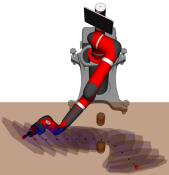
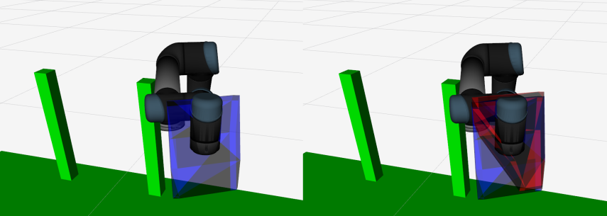
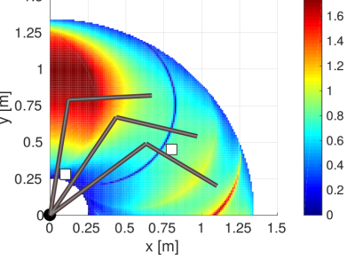
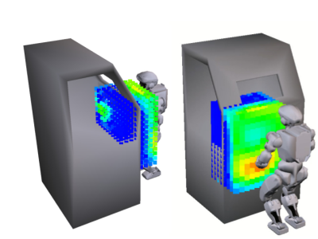

# Constrained Manipulability
Constrained Manipulability is a library used to compute and vizualize a robot's constrained capacities. 

## Features
 - Compute a robot's constrained allowable Cartesian motions due to collision avoidance constraints and joint limits
 - Compute a robot's constrained manipulability polytope due to dangerfield constraints
 - Static functions that allow the above quantities to be used in optimization algorithms for collision free trajectory optimization

## Installation 
### Dependencies
- [ROS](http://wiki.ros.org/catkin) 
    - [pinnochio](https://index.ros.org/p/pinocchio/)
    - [rospygradientpolytope](https://github.com/KeerthiSagarSN/rospygradientpolytope)
    - [eigenpy](https://index.ros.org/p/eigenpy/)
- [example-robot-data](https://github.com/Gepetto/example-robot-data)
- [pypoman](https://pypi.org/project/pypoman/)


### Install instructions
Clone repo into your current workspace as follows:
```
cd catkin_ws/src
git clone https://github.com/KeerthiSagarSN/constrained_manipulability.git
git checkout noetic-python
cd ..
rosdep install -r --from-paths . --ignore-src --rosdistro $ROS_DISTRO -y
catkin build
```

### Examples
Demos can be launched for a robot, using the provided test file:
```
roslaunch constrained_manipulability launch_robot_abstract.launch
```


## Launching IK Teleoperation Test
First launch the interactive IK server:
```
$ git clone https://gitlab.com/KeerthiSagarSN/inverse_kinematics_interactive_rviz.git
$ cd ..
$ catkin build
$ source devel/setup.bash
```
Then launch the sample IK file. This calls the polytope server then uses the convex constraints in an optimization routine use sim parameter for visualization only or else pass the robot's joint states:
```
roslaunch inverse_kinematics_interactive_rviz inverse_kinematics_interactive_rviz.launch
```


We use [slsqp](https://docs.scipy.org/doc/scipy/reference/optimize.minimize-slsqp.html) as the solver cost function:
```
cost=cp.sum_squares(jacobian@dq - dx)
```
subject to 
```
A@dq<= b
```

## Computation:
The polytopes are calculated by obtaining the minimum distance from each link on the robot to objects in the collision world. FCL is used to compute these distance and access via the interface package [hpp-fcl](https://pypi.org/project/hpp-fcl/) which is native inside the pinnochio package. 

Different Polytopes are available more information about allowable motion polytope is available here __Optimization-Based Human-in-the-Loop Manipulation  Using Joint Space Polytopes, Long et al 2019__ more information about the constrained velocity polytope is available here __Evaluating Robot Manipulability in Constrained Environments by Velocity Polytope Reduction Long et al 2018.__ 


## Applications:
A video showing the applications of the constrained allowable motion polytope is available [here](https://youtu.be/oeqj-m25t9c). A video showing the uses of the constrained velocity polytope for humanoid robots can be seen [here](https://www.youtube.com/watch?v=1Nouc4f_rIY) and [here](https://www.youtube.com/watch?v=FzlhsLH5IPU).


#### 1. Motion planning
Planning collision free paths can be achieved by maximizing the volume of the allowable motion polytope, however since no analytical gradient is available this is typically slower than other motion planning algorithms. Nevertheless, since the polytopes are returned they can be used for fast on-line inverse kinematic solutions and guard teleoperation. 



#### 2. Guarded teleoperation
The polytopes are convex constraints that represent feasible configuration for the whole robot. By respecting them a guaranteed feasible inverse kinematic solution can be obtained very quickly, this can be useful for generating virtual fixtures for teleoperation tasks. The polytope can be vizualized (in red below) showing an operator the Cartesian motions available at all times due to joint limits, kinematic constraints and obstacles in the workspace. The original polytope is shown below in blue/



#### 3. Workspace Analysis
By evaluating the volume of the CMP at points in the workspace, a reachability map can be obtained see this [video](https://youtu.be/jc7X4WakdoE)


 

## Citing

If you use this package, please cite either:

```
@inproceedings{Long2019Optimization,
  title={Optimization-Based Human-in-the-Loop Manipulation  Using Joint Space Polytopes},
  author={Philip Long, Tar{\i}k Kele\c{s}temur, Aykut \"{O}zg\"{u}n \"{O}nol and Ta\c{s}k{\i}n Pad{\i}r },
  booktitle={2019 IEEE International Conference on Robotics and Automation (ICRA)},
  year={2019},
  organization={IEEE}
}
```

or 

```
@INPROCEEDINGS{Long2018Evaluating,
  author={P. {Long} and T. {Padir}},
  booktitle={2018 IEEE-RAS 18th International Conference on Humanoid Robots (Humanoids)},
  title={Evaluating Robot Manipulability in Constrained Environments by Velocity Polytope Reduction},
  year={2018},
  volume={},
  number={},
  pages={1-9},
  doi={10.1109/HUMANOIDS.2018.8624962},
  ISSN={2164-0580},
  month={Nov},}
```

And for the teleoperation use-case, especially alongside AR/VR, then please also cite:

```
@ARTICLE{Zolotas2021Motion,
  AUTHOR={Zolotas, Mark and Wonsick, Murphy and Long, Philip and Padır, Taşkın},   
  TITLE={Motion Polytopes in Virtual Reality for Shared Control in Remote Manipulation Applications},      
  JOURNAL={Frontiers in Robotics and AI},      
  VOLUME={8},           
  YEAR={2021},      	
  DOI={10.3389/frobt.2021.730433},      
  ISSN={2296-9144},
}
```
