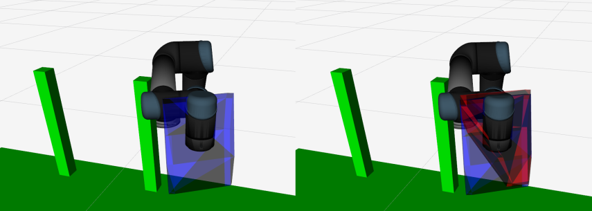
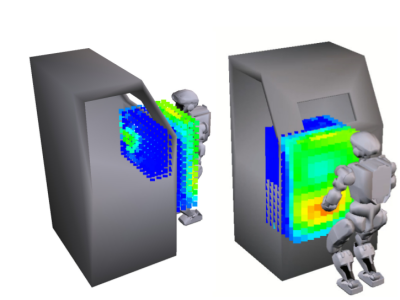

# Constrained Manipulability

Constrained Manipulability is a library used to compute and vizualize a robot's constrained capacities. 

## Features
 - Compute a robot's constrained allowable Cartesian motions due to collision avoidance constraints and joint limits
 - Compute a robot's constrained manipulability polytope due to dangerfield constraints
 - A ROS 2 interface that allows the above quantities to be used in IK optimization algorithms for collision-free trajectory optimization

## Installation 

### Dependencies

- [ROS 2 Humble](https://docs.ros.org/en/humble/index.html) 
    - [tf2_eigen](https://docs.ros2.org/foxy/api/tf2_eigen/) 
    - [geometric_shapes](https://github.com/moveit/geometric_shapes/tree/ros2)
    - [pcl_ros](https://github.com/ros-perception/perception_pcl)
    - [kdl_parser](https://github.com/ros/kdl_parser/tree/ros2)
- [Eigen 3](https://eigen.tuxfamily.org/dox/GettingStarted.html)
- [robot_collision_checking](https://github.com/philip-long/robot_collision_checking)
- [eigen-cddlib](https://github.com/philip-long/eigen-cddlib)
- [octomap_filter](https://github.com/mazrk7/octomap_filter)
- octomap_server
  ```
  sudo apt-get install ros-humble-octomap-server
  ```
- octomap_rviz_plugins
  ```
  sudo apt-get install ros-humble-octomap-rviz-plugins
  ```

### Install Instructions

Clone repo into your current workspace as follows:
```
cd polytope_ws/src
git clone https://github.com/philip-long/constrained_manipulability.git
cd ..
colcon build --symlink-install
```


### Examples

An template robot launch can run using the `abstract_robot.launch.py` file:
```
 ros2 launch constrained_manipulability abstract_robot.launch.py root:=<your root link> tip:=<your end-effector link>  scene_config:=<your scene config stored in a .yaml file>
```
However, a robot state description will need to be provided/launched separately. For instance, there are several other complete example robot launches and scenes in `config` folder. Please include in your workshape the necessary ROS 2 Universal Robot repositories (either [Universal_Robots_ROS2_Description](https://github.com/UniversalRobots/Universal_Robots_ROS2_Description) for just the state description or [Universal_Robots_ROS2_Driver](https://github.com/UniversalRobots/Universal_Robots_ROS2_Driver) for the real robot) and/or Kinova Gen3 repository (requires [ros2_kortex](https://github.com/Kinovarobotics/ros2_kortex)) if testing with either/both. The launch file for the UR3e can be run as:
```
ros2 launch constrained_manipulability abstract_ur3e.launch.py
```
And for the Kinova Gen3 as:
```
ros2 launch constrained_manipulability abstract_gen3.launch.py
```

Please note in the default RViz config file that appears, you should add the `/visualization_marker` topic to see the scene and polytopes.


## Shrinking Polytopes

You can explore an example of shrinking polytopes (changing the linearization limits) by running this launch file:
```
ros2 launch constrained_manipulability shrinking_polytope.launch.py
```

Modify the limits using the sliding bar that appears and again add the `/visualization_marker` topic to your RViz display.

## IK Teleoperation

The following example illustrates how to perform IK teleoperation based on the polytope constraints computed in the `constrained_manipulability` package. Please first run the server with a UR3e configuration (as well as an octomap scene):
```
ros2 launch constrained_manipulability cm_server_example.launch.py
```
Then run the IK client node, which uses the convex constraints in an optimization routine:
```
ros2 run constrained_manipulability cm_client.py
```
If using a real robot's joint states (default topic: `/in_joint_states`), or use the `sim` parameter if for visualization only:
```
ros2 run constrained_manipulability cm_client.py --ros-args -p sim:=true
```

We use [cvxpy](https://www.cvxpy.org/) (pip install cvxpy) as the solver cost function:
```
cost = cp.sum_squares(jacobian@dq - dx)
```
subject to 
```
A@dq <= b
```
where "dx" is a desired change in position and input `geometry_msgs/Twist`. The input Twist can be generated by a teleop command (recommended setting for speed is ~0.03 and turn ~0.014):
```
ros2 run teleop_twist_keyboard teleop_twist_keyboard
```

## Computation:

The `ConstrainedManipulability` node reads a kinematic chain from ROS 2 parameters, starting at the root of the robot and running until its tip or end-effector. The joint position and velocity limits are also read and are used to define the different polytopes. A collision world is also maintained, with a variety of objects that can be added/removed using [shape_msgs](https://docs.ros2.org/foxy/api/shape_msgs/index-msg.html) and `Eigen::Affine3d`.

The polytopes are calculated by obtaining the minimum distance from each link on the robot to objects in the collision world. FCL is used to compute these distances and is accessible via the interface package [robot_collision_checking](https://github.com/philip-long/ros_collision_checking). Polytopes in _Cartesian_ space can be returned from getter functions, like:

```
Polytope getConstrainedAllowableMotionPolytope(const sensor_msgs::msg::JointState& joint_state,
                                               bool show_polytope, 
                                               Eigen::MatrixXd& AHrep,
                                               Eigen::VectorXd& bHrep,
                                               Eigen::Vector3d& offset_position,
                                               const std::vector<double>& color_pts = {0.0, 0.0, 0.5, 0.0}, 
                                               const std::vector<double>& color_line = {1.0, 0.0, 0.0, 0.4});
```
"AHrep" and "bHrep" represent the joint space polytope constraints, i.e.:
```
AHrep*dq <= bHrep
```
Conversion from H-representation to V-representation is achieved using the Double Description method via [eigen-cddlib](https://github.com/philip-long/eigen-cddlib).

Different polytopes can be computed. More information about the allowable motion polytope is available here: __Optimization-Based Human-in-the-Loop Manipulation Using Joint Space Polytopes, Long et al 2019__. And more information about the constrained velocity polytope is available here: __Evaluating Robot Manipulability in Constrained Environments by Velocity Polytope Reduction Long et al 2018__. 

#### Octomaps

Octomaps can also be used to as objects, but require the [octomap_filter](https://github.com/mazrk7/octomap_filter) to remove the robot body from the OcTree representation.


## Applications:

A video showing the applications of the constrained allowable motion polytope is available [here](https://youtu.be/oeqj-m25t9c). A video showing the utility of the constrained velocity polytope for humanoid robots can be found [here](https://www.youtube.com/watch?v=1Nouc4f_rIY) and [here](https://www.youtube.com/watch?v=FzlhsLH5IPU).

#### 1. Motion planning

Planning collision free paths can be achieved by maximizing the volume of the allowable motion polytope, however since no analytical gradient is available this is typically slower than other motion planning algorithms. Nevertheless, since the polytopes are returned they can be used for fast on-line IK solutions and guarded teleoperation. 


#### 2. Guarded teleoperation

The polytopes are convex constraints that represent feasible configuration for the whole robot. By respecting these constraints, a guaranteed feasible IK solution can be obtained very quickly, which can be useful for generating virtual fixtures in teleoperation tasks. The polytope vizualized in red below shows an operator the Cartesian motions available at all times due to joint limits, kinematic constraints, and obstacles in the workspace. The original polytope is shown below in blue.



#### 3. Workspace Analysis

By evaluating the volume of the constrained manipulability polytope at points in the workspace, a reachability map can be obtained as in this [video](https://youtu.be/jc7X4WakdoE).

 

## References

If you use this package, please cite either:
```
@inproceedings{Long2019Optimization,
  title={Optimization-Based Human-in-the-Loop Manipulation  Using Joint Space Polytopes},
  author={Philip Long, Tar{\i}k Kele\c{s}temur, Aykut \"{O}zg\"{u}n \"{O}nol and Ta\c{s}k{\i}n Pad{\i}r },
  booktitle={2019 IEEE International Conference on Robotics and Automation (ICRA)},
  year={2019},
  organization={IEEE}
}
```
or 
```
@INPROCEEDINGS{Long2018Evaluating,
  author={P. {Long} and T. {Padir}},
  booktitle={2018 IEEE-RAS 18th International Conference on Humanoid Robots (Humanoids)},
  title={Evaluating Robot Manipulability in Constrained Environments by Velocity Polytope Reduction},
  year={2018},
  volume={},
  number={},
  pages={1-9},
  doi={10.1109/HUMANOIDS.2018.8624962},
  ISSN={2164-0580},
  month={Nov},}
```
and for the teleoperation use-case, especially alongside AR/VR, then please also cite:
```
@ARTICLE{Zolotas2021Motion,
  AUTHOR={Zolotas, Mark and Wonsick, Murphy and Long, Philip and Padır, Taşkın},   
  TITLE={Motion Polytopes in Virtual Reality for Shared Control in Remote Manipulation Applications},      
  JOURNAL={Frontiers in Robotics and AI},      
  VOLUME={8},           
  YEAR={2021},      	
  DOI={10.3389/frobt.2021.730433},      
  ISSN={2296-9144},
}
```
